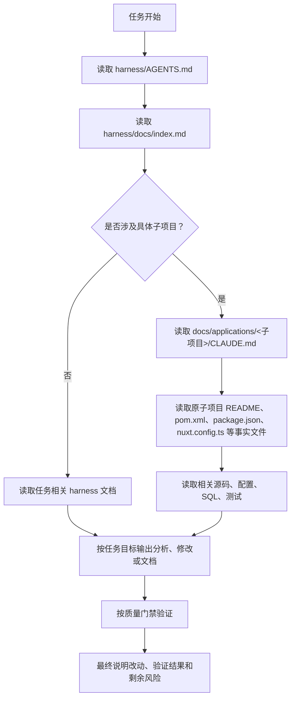

# **Harness 使用分享**

## **文档信息**

分享人：韦节镇（研发4组）

分享时间：2026年7月16日

## **一、harness 使用定位**

| 项目     | 说明                                       |
| ------ | ---------------------------------------- |
| 它是什么   | AI 协作文档骨架，用于沉淀阅读路径、协作规则、质量门禁和长期经验        |
| 它不是什么  | 不是业务代码仓，也不是 Harness CI/CD 平台配置           |
| 谁使用    | Codex、Claude 等 AI 工具，以及需要给 AI 提供上下文的研发人员 |
| 解决什么问题 | 减少 AI 读错项目、忽略规则、跨模块误改、验证不完整、经验无法复用的问题    |
| 业务代码基准 | 业务代码仍以各子项目目录为准                           |

## **二、总读取顺序**



核心口径：

| 顺序  | 读取内容                                | 作用                                                |
| --- | ----------------------------------- | ------------------------------------------------- |
| 1   | `harness/AGENTS.md`                 | 明确全局 AI 协作入口、强制规则和任务类型入口                          |
| 2   | `harness/docs/index.md`             | 判断本次任务应该读哪些规则和子项目入口                               |
| 3   | `docs/rules/**`                     | 读取全局前端、Java、分页、测试、Review 等规则                      |
| 4   | `docs/applications/<子项目>/CLAUDE.md` | 读取具体应用的模块边界、命令、约束和注意事项                            |
| 5   | 原子项目事实文件                            | 用当前 `README.md`、`pom.xml`、`package.json`、配置文件校准事实 |
| 6   | 源码、SQL、测试、配置                        | 以当前实际代码为最终依据                                      |

使用 harness 时，先记住六条原则：

1. 先给上下文，再让 AI 输出。
2. 先读规则，再读代码，再动手。
3. 只处理本次任务相关范围，不顺手重构无关模块。
4. AI 输出必须可验证，不能只看文字感觉正确。（目前研发最耗时）
5. 涉及数据、安全、权限、发布和生产环境时，必须人工复核。
6. 文档和代码冲突时，以当前代码、SQL、配置和构建文件为准，再同步修正文档。 

## **三、按任务类型分流**

| 任务类型                | 必读入口                                                                        | 重点关注                                                          |
| ------------------- | --------------------------------------------------------------------------- | ------------------------------------------------------------- |
| 后端功能、接口、数据库         | `docs/rules/java/patterns.md`、对应后端 `CLAUDE.md`                              | 模块边界、Controller/Service 分层、DO、数据权限、SQL 回滚                     |
| 管理后台前端页面、路由、请求      | `docs/rules/web/patterns.md`、`applications/shop-trade-service-ui/CLAUDE.md` | 动态路由、菜单权限、接口封装、缓存、Element Plus 风格                             |
| Portal 前台页面、SEO、SSR | `applications/shop-trade-service-portal/CLAUDE.md`                          | Nuxt 页面、SSR、SEO、多语言、聚合接口                                      |
| 分页接口或分页请求改造         | `docs/rules/common/api-page-method.md`、对应应用 `page-query-convention.md`      | `/page`、`/table/page`、`/copy/page` 统一使用 `POST + request body` |
| SQL 清理、初始化数据        | `docs/experience/sql-cleanup-retention.md`                                  | 保留范围、关联表同步、主键自增、是否真实执行                                        |
| 验证、测试、发布前检查         | `docs/qa/quality-gates.md`                                                  | 验证命令、未验证风险、最终说明                                               |
| 本地启动、环境排查           | `docs/runbooks/local-dev.md`                                                | Nacos、MySQL、Redis、Nexus、端口和环境变量                               |
| 文档更新                | `docs/conventions.md`                                                       | 文档路径、用途、状态、维护规则                                               |

## **四、使用闭环**

### **通用任务模板**

```
请按 shop-trade harness 规则处理以下任务。

任务背景：
涉及子项目：
期望输出：
允许修改范围：
禁止修改范围：
必须读取的资料：
验收标准：
需要人工确认的问题：
```

### **需求建表模板**

```text
请根据当前项目 SQL 和 Java 后端规范，生成建表方案。

业务背景：
所属模块：
表用途：
核心字段：
是否需要租户隔离：
是否需要数据权限：
唯一约束：
索引要求：
关联表：
输出要求：建表 SQL、回滚 SQL、DO 字段建议、人工审核清单。
```

### **前端页面模板**

```text
请按管理后台前端规则实现或分析页面。

页面名称：
菜单路径：
接口列表：
权限标识：
页面功能：
查询条件：
表格字段：
新增/编辑/删除规则：
验证方式：pnpm ts:check、pnpm lint:eslint、受影响页面手动验证。
```

### **代码审查模板**

```text
请按 harness 代码审查规则检查本次改动。

重点关注：
1. 数据、权限、租户隔离风险。
2. 编译、空指针、接口或路由不可达风险。
3. SQL 顺序、关联表、自增值风险。
4. 前端菜单、权限、动态路由和缓存风险。
5. 测试和验证缺口。

请按严重程度输出问题、文件位置、原因和建议。## 
```

| 阶段  | 人做什么             | AI 做什么           | 输出        |
| --- | ---------------- | ---------------- | --------- |
| 输入  | 提供业务目标、限制范围、验收标准 | 读取入口和规则          | 明确任务边界    |
| 分析  | 确认业务规则和风险点       | 梳理影响范围、待确认问题     | 分析结论或实施路径 |
| 执行  | 审核关键取舍           | 修改代码、SQL 或文档     | 变更结果      |
| 验证  | 确认验证是否足够         | 运行或说明验证命令        | 验证结果      |
| 复盘  | 判断是否长期沉淀         | 更新 harness 文档或经验 | 可复用规则     |

## **五、真实案例分享**

### **后端接口和分页查询**

新增接口时，AI 必须按现有 Controller、Service、DAL 分层处理，不允许把业务逻辑写进 Controller。

分页查询统一使用 `POST`：

```java
@PostMapping("/page")
public CommonResult<PageResult<DemoRespVO>> getDemoPage(
        @Valid @RequestBody DemoPageReqVO pageReqVO) {
    ...
}
```

前端 API 层同步使用：

```ts
export const getDemoPage = (params) => {
  return request.post({ url: '/demo/page', data: params })
}
```

禁止只改前端或只改后端。涉及 Feign/RPC 分页接口时，也要同步检查 `@PostMapping + @RequestBody`。

### **管理后台前端页面**

管理后台是“后端菜单驱动 + 前端运行时生成路由”模式。新增或调整页面时，必须同时检查：

- `src/api/**` 是否有独立接口封装。
- `src/views/**` 下页面路径是否能被 `routerHelper` 映射。
- 后端 `system_menu` 菜单数据是否正确。
- 权限标识是否和后端 `@PreAuthorize("@ss.hasPermission(...)")` 一致。
- 登录态、菜单、租户和字典缓存是否影响验证结果。

前端开发默认使用 `pnpm`，不要切换到 npm，默认验证路径是类型检查、lint 和受影响功能手动验证。

### **菜单权限和按钮权限**

只要新增后台页面、按钮操作、接口权限控制、页面路由调整或复用权限，都必须同步输出：

1. 功能名称。
2. 是否新增菜单 SQL。
3. 新增权限标识清单。
4. 复用权限标识清单。
5. 菜单层级关系。
6. SQL 文件路径。
7. 权限差异或风险说明。

权限标识不能只参考旧 SQL，必须以当前后端 Controller 中实际使用的 `@PreAuthorize` 为准。

## **六、质量门禁表**

| 改动类型      | 默认验证                                                 | 必须说明                                           |
| --------- | ---------------------------------------------------- | ---------------------------------------------- |
| 只读分析      | 读取了哪些关键资料                                            | 结论、依据、风险、建议                                    |
| 文档改动      | 路径、编码、链接、关键词静态检查                                     | 修改文件、未验证项                                      |
| SQL 改动    | 分号、执行顺序、关键表、自增值静态检查                                  | 是否真实连接数据库执行                                    |
| Java 后端改动 | 受影响 Maven 模块 `compile`、指定测试或 `test`                  | 未运行原因、剩余风险                                     |
| 前端改动      | `pnpm ts:check`、`pnpm lint:eslint`、`pnpm lint:style` | 菜单、动态路由、权限和页面手动验证情况                            |
| 分页接口改造    | 后端 Controller、前端 API、Feign/RPC 同步检查                  | 是否仍存在 `GET /page` 或 `request.get(.../page...)` |
| 菜单权限改动    | 后端 `@PreAuthorize`、菜单 SQL、前端路由映射                     | 新增权限、复用权限、差异说明                                 |

## **七、常见使用提醒**

| 场景     | 正确做法                                       | 禁止或高风险做法       |
| ------ | ------------------------------------------ | -------------- |
| 中文文档读取 | PowerShell 使用 `Get-Content -Encoding UTF8` | 乱码后继续基于错误内容判断  |
| 文件搜索   | 优先使用 `rg` 或 `rg --files`                   | 大范围无目标翻文件      |
| 用户已有改动 | 不回滚、不覆盖，先读取最新内容                            | 随意清理工作区或恢复旧版本  |
| 前端依赖命令 | 默认使用 `pnpm`                                | 切换到 npm        |
| 后端技术栈  | 默认 Java 17、Maven、多模块结构                     | 绕过现有模块边界       |
| 分页查询   | 统一 `POST + request body`                   | 新增 `GET /page` |
| SQL 清理 | 以最新 `retain-red-box-data.sql` 为基准          | 凭记忆修改保留范围      |
| 无法验证   | 最终说明原因和替代检查                                | 声称已验证或已完成      |
